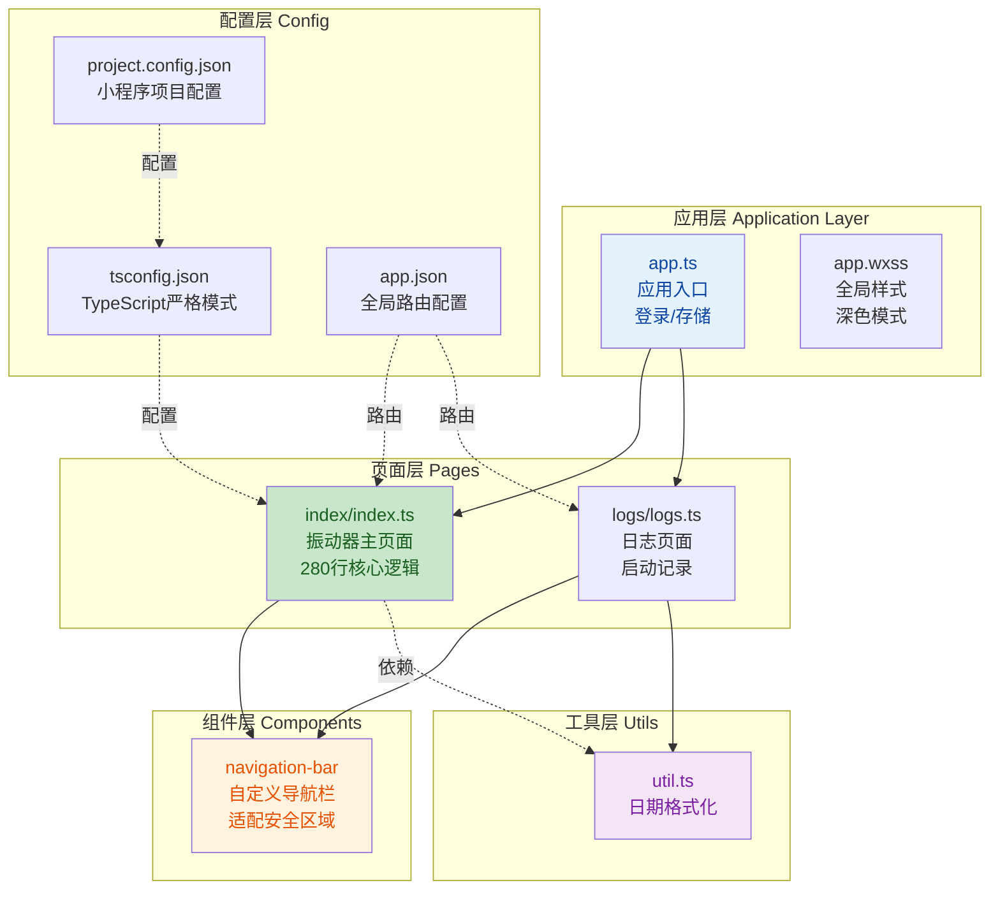
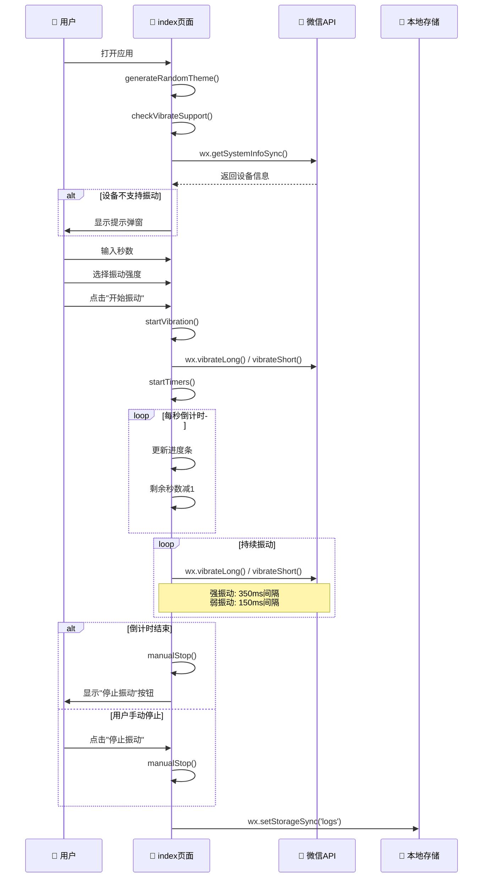

## 📋 高层摘要 (TL;DR)

**影响范围:** 🟢 **高** - 这是一个全新的微信小程序项目，从零开始创建

**核心变更:**
- ✨ 创建了一个功能完整的"振动器"微信小程序
- 🎨 实现了随机主题色、深色模式支持、响应式设计
- ⚙️ 集成了TypeScript严格模式开发环境
- 📱 自定义导航栏组件，适配iOS/Android安全区域
- 🔄 支持强/弱振动强度切换和倒计时功能

---

## 🗺️ 可视化架构图



---

## 📊 核心业务流程



---

## 🔍 详细变更分析

### 1️⃣ 项目配置与开发环境

#### TypeScript 严格模式配置
**文件:** `tsconfig.json`

| 配置项 | 值 | 说明 |
|--------|-----|------|
| `strict` | `true` | 启用所有严格类型检查 |
| `strictNullChecks` | `true` | 严格空值检查 |
| `noImplicitAny` | `true` | 禁止隐式 any 类型 |
| `noUnusedLocals` | `true` | 检查未使用的局部变量 |
| `noUnusedParameters` | `true` | 检查未使用的参数 |
| `target` | `ES2020` | 编译目标版本 |
| `module` | `CommonJS` | 模块系统 |

#### 微信小程序项目配置
**文件:** `project.config.json`

| 配置项 | 值 | 说明 |
|--------|-----|------|
| `miniprogramRoot` | `miniprogram/` | 小程序根目录 |
| `compileType` | `miniprogram` | 编译类型 |
| `useCompilerPlugins` | `["typescript"]` | 启用TypeScript编译插件 |
| `appid` | `wxcbd33d39fc66b4be` | 小程序AppID |
| `navigationStyle` | `custom` | 自定义导航栏 |

#### 依赖管理
**文件:** `package.json`

| 包名 | 版本 | 用途 |
|------|------|------|
| `miniprogram-api-typings` | `^2.8.3-1` | 微信小程序API类型定义 |

---

### 2️⃣ 应用入口与全局配置

#### 应用入口文件
**文件:** `miniprogram/app.ts`

**核心功能:**
- ✅ 应用启动时记录日志到本地存储
- ✅ 调用 `wx.login()` 获取登录凭证
- ✅ 初始化全局数据 `globalData`

```typescript
App<IAppOption>({
  globalData: {},
  onLaunch() {
    // 记录启动日志
    const logs = wx.getStorageSync('logs') || []
    logs.unshift(Date.now())
    wx.setStorageSync('logs', logs)
    
    // 微信登录
    wx.login({
      success: res => {
        console.log(res.code)
        // 发送 res.code 到后台换取 openId, sessionKey, unionId
      },
    })
  },
})
```

#### 全局样式与深色模式
**文件:** `miniprogram/app.wxss`

**CSS 变量定义:**

| 变量名 | 浅色模式 | 深色模式 | 用途 |
|--------|----------|----------|------|
| `--bg-primary` | `#ffffff` | `#1a1a1a` | 主背景色 |
| `--bg-secondary` | `#f5f5f5` | `#2a2a2a` | 次背景色 |
| `--text-primary` | `#333333` | `#ffffff` | 主文字色 |
| `--text-secondary` | `#666666` | `#cccccc` | 次文字色 |
| `--text-muted` | `#999999` | `#666666` | 弱化文字色 |

#### 全局路由配置
**文件:** `miniprogram/app.json`

| 配置项 | 值 | 说明 |
|--------|-----|------|
| `pages` | `["pages/index/index", "pages/logs/logs"]` | 页面路径列表 |
| `navigationBarTitleText` | `"振动器"` | 导航栏标题 |
| `navigationStyle` | `"custom"` | 自定义导航栏样式 |
| `lazyCodeLoading` | `"requiredComponents"` | 按需加载组件 |

---

### 3️⃣ 振动器主页面 (核心功能)

#### 页面数据结构
**文件:** `miniprogram/pages/index/index.ts`

| 字段名 | 类型 | 说明 |
|--------|------|------|
| `seconds` | `string` | 用户输入的秒数 |
| `isVibrating` | `boolean` | 是否正在振动 |
| `remainingSeconds` | `number` | 剩余秒数 |
| `progress` | `number` | 进度条百分比 (0-100) |
| `lastSeconds` | `string` | 上次使用的秒数 |
| `showReuseButton` | `boolean` | 是否显示"使用上次时间"按钮 |
| `themeColor` | `string` | 主题渐变色1 (HSL格式) |
| `themeColor2` | `string` | 主题渐变色2 (HSL格式) |
| `textColor` | `string` | 文字颜色 (根据背景亮度自动计算) |
| `supportVibrate` | `boolean` | 设备是否支持振动 |
| `deviceModel` | `string` | 设备型号 |
| `vibrateIntensity` | `'strong' \| 'weak'` | 振动强度 |

#### 核心方法分析

##### ① 设备振动支持检测
```typescript
checkVibrateSupport() {
  const systemInfo = wx.getSystemInfoSync()
  const platform = (systemInfo.platform || '').toLowerCase()
  const unsupportedPlatforms = ['windows', 'mac', 'linux', 'pc']
  const isUnsupported = unsupportedPlatforms.some(p => platform.includes(p))
  
  this.setData({
    supportVibrate: !isUnsupported,
    deviceModel: systemInfo.model || '未知设备',
  })
  
  if (isUnsupported) {
    wx.showModal({
      title: '设备不支持',
      content: `您的设备${model} ${platform}不支持振动功能`,
      showCancel: false,
    })
  }
}
```

##### ② 随机主题色生成
```typescript
generateRandomTheme() {
  const hue = Math.floor(Math.random() * 360)
  const saturation = Math.floor(Math.random() * 30) + 60
  const lightness1 = Math.floor(Math.random() * 15) + 45
  const lightness2 = Math.floor(Math.random() * 15) + 30
  
  const color1 = `hsl(${hue}, ${saturation}%, ${lightness1}%)`
  const color2 = `hsl(${hue}, ${saturation}%, ${lightness2}%)`
  
  // 根据平均亮度自动计算文字颜色
  const avgLightness = (lightness1 + lightness2) / 2
  const textColor = avgLightness < 50 ? '#ffffff' : '#333333'
  
  this.setData({ themeColor: color1, themeColor2: color2, textColor })
}
```

##### ③ 振动控制逻辑

**振动参数配置:**

| 强度 | API调用 | 间隔时间 | 说明 |
|------|---------|----------|------|
| 强 | `wx.vibrateLong()` | 350ms | 长振动，间隔较长 |
| 弱 | `wx.vibrateShort({ type: 'light' })` | 150ms | 轻振动，间隔较短 |

**定时器管理:**
- `timer`: 倒计时定时器 (每秒执行一次)
- `vibrateTimer`: 振动循环定时器 (根据强度设置不同间隔)

---

### 4️⃣ 自定义导航栏组件

#### 组件属性定义
**文件:** `miniprogram/components/navigation-bar/navigation-bar.ts`

| 属性名 | 类型 | 默认值 | 说明 |
|--------|------|--------|------|
| `title` | `String` | `''` | 导航栏标题 |
| `background` | `String` | `''` | 背景颜色 |
| `color` | `String` | `''` | 文字颜色 |
| `back` | `Boolean` | `true` | 是否显示返回按钮 |
| `homeButton` | `Boolean` | `false` | 是否显示首页按钮 |
| `loading` | `Boolean` | `false` | 是否显示加载状态 |
| `animated` | `Boolean` | `true` | 是否启用透明度动画 |
| `show` | `Boolean` | `true` | 是否显示导航栏 |
| `delta` | `Number` | `1` | 返回的页面层级 |

#### 安全区域适配逻辑
```typescript
attached() {
  const rect = wx.getMenuButtonBoundingClientRect()
  wx.getSystemInfo({
    success: (res) => {
      const isAndroid = res.platform === 'android'
      const isDevtools = res.platform === 'devtools'
      
      this.setData({
        ios: !isAndroid,
        // 计算右侧内边距，避开胶囊按钮
        innerPaddingRight: `padding-right: ${res.windowWidth - rect.left}px`,
        leftWidth: `width: ${res.windowWidth - rect.left}px`,
        // Android/开发工具需要额外的顶部安全区域
        safeAreaTop: isDevtools || isAndroid 
          ? `height: calc(var(--height) + ${res.safeArea.top}px); padding-top: ${res.safeArea.top}px` 
          : ``
      })
    }
  })
}
```

#### 导航栏高度配置

| 平台 | 基础高度 | 说明 |
|------|----------|------|
| iOS | `44px` | 标准导航栏高度 |
| Android | `48px` | 稍高的导航栏 |
| 实际高度 | `基础高度 + safe-area-inset-top` | 适配刘海屏 |

---

### 5️⃣ 日志页面与工具函数

#### 日志页面
**文件:** `miniprogram/pages/logs/logs.ts`

```typescript
Component({
  data: { logs: [] },
  lifetimes: {
    attached() {
      this.setData({
        logs: (wx.getStorageSync('logs') || []).map((log: string) => ({
          date: formatTime(new Date(log)),
          timeStamp: log
        }))
      })
    }
  }
})
```

#### 日期格式化工具
**文件:** `miniprogram/utils/util.ts`

```typescript
export const formatTime = (date: Date) => {
  const year = date.getFullYear()
  const month = date.getMonth() + 1
  const day = date.getDate()
  const hour = date.getHours()
  const minute = date.getMinutes()
  const second = date.getSeconds()
  
  return [year, month, day].map(formatNumber).join('/') + ' ' +
         [hour, minute, second].map(formatNumber).join(':')
}

const formatNumber = (n: number) => {
  const s = n.toString()
  return s[1] ? s : '0' + s  // 补零
}
```

**输出格式:** `2026/06/17 16:59:30`

---

### 6️⃣ 响应式样式设计

#### 断点配置
**文件:** `miniprogram/pages/index/index.wxss`

| 断点 | 屏幕宽度 | 调整内容 |
|------|----------|----------|
| 极小屏 | `≤320px` | 卡片边距 `20px 16px`，标题字号缩小 |
| 小屏 | `≤375px` | 卡片边距 `28px 20px`，头部间距压缩 |
| 标准 | `>375px` | 默认样式 |
| 平板 | `≥768px` | 卡片边距 `40px 30px`，最大宽度 `400px` |

#### 深色模式适配
```css
@media (prefers-color-scheme: dark) {
  page {
    background: #000000;
  }
  .card {
    box-shadow: 0 12px 34px rgba(0, 0, 0, 0.5);
  }
}
```

---

## ⚠️ 影响与风险评估

### 🔴 潜在风险

| 风险项 | 严重程度 | 说明 | 缓解措施 |
|--------|----------|------|----------|
| **振动API兼容性** | 中 | 部分设备/模拟器不支持振动 | 已实现设备检测和提示 |
| **定时器泄漏** | 高 | 页面卸载时未清理定时器可能导致内存泄漏 | ⚠️ 需要在 `onUnload` 中添加清理逻辑 |
| **TypeScript类型断言** | 低 | 代码中使用了 `@ts-ignore` 和类型断言 | 建议补充完整的类型定义 |
| **深色模式文字可读性** | 低 | 随机生成的主题色可能影响文字对比度 | 已实现亮度自动计算，但需测试边界情况 |

### ✅ 建议测试场景

1. **功能测试:**
   - ✅ 输入不同秒数 (1-999秒) 验证倒计时准确性
   - ✅ 切换强/弱振动，验证振动频率差异
   - ✅ 点击"使用上次时间"按钮，验证数据复用
   - ✅ 手动停止振动，验证定时器正确清理

2. **兼容性测试:**
   - 📱 在真机 (iOS/Android) 上测试振动功能
   - 💻 在开发者工具中测试非振动设备提示
   - 🌓 切换系统深色/浅色模式，验证主题适配

3. **边界测试:**
   - 🔢 输入 `0`、负数、非数字字符，验证错误提示
   - 📱 在不同屏幕尺寸 (iPhone SE/12 Pro Max/平板) 上测试布局
   - 🔄 快速连续点击"开始/停止"按钮，验证状态正确性

4. **性能测试:**
   - ⏱️ 长时间振动 (如10分钟)，验证内存占用
   - 🎨 多次刷新页面，验证主题色随机性

---

## 📝 代码改进建议

### 1. 定时器清理 (高优先级)
**问题:** 页面卸载时未清理定时器

**建议:** 在 `index.ts` 中添加:
```typescript
onUnload() {
  if (this.timer) {
    clearInterval(this.timer)
    this.timer = null
  }
  if (this.vibrateTimer) {
    clearTimeout(this.vibrateTimer)
    this.vibrateTimer = null
  }
}
```

### 2. 类型定义优化
**问题:** 使用了 `@ts-ignore` 和 `any` 类型

**建议:** 补充完整的接口定义:
```typescript
interface IPageData {
  seconds: string
  isVibrating: boolean
  remainingSeconds: number
  // ... 其他字段
}

interface ISystemInfo {
  platform: string
  model: string
  windowWidth: number
  safeArea: { top: number }
}

Page<IPageData>({
  // ...
})
```

### 3. 振动频率优化
**建议:** 将振动间隔配置为可调参数，提升灵活性:
```typescript
const VIBRATE_CONFIG = {
  strong: { interval: 350, api: 'vibrateLong' },
  weak: { interval: 150, api: 'vibrateShort' }
}
```

---

## 🎯 总结

这是一个**从零创建**的微信小程序项目，实现了完整的振动器功能。代码质量整体良好，具有以下亮点:

✅ **优点:**
- TypeScript严格模式，类型安全性高
- 响应式设计，适配多种屏幕尺寸
- 深色模式支持，用户体验友好
- 设备兼容性检测，优雅降级
- 组件化设计，导航栏可复用

⚠️ **需改进:**
- 缺少定时器清理逻辑，存在内存泄漏风险
- 部分类型定义不完整，使用了 `@ts-ignore`
- 建议添加单元测试和E2E测试

**总体评价:** 🟢 **良好** - 适合作为微信小程序开发的参考模板